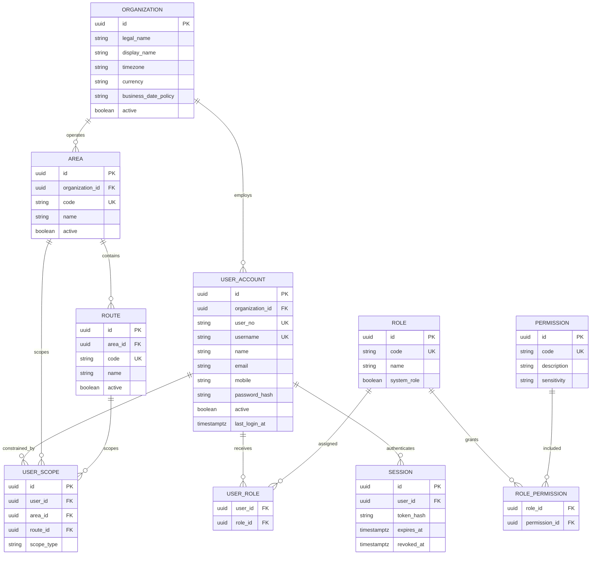
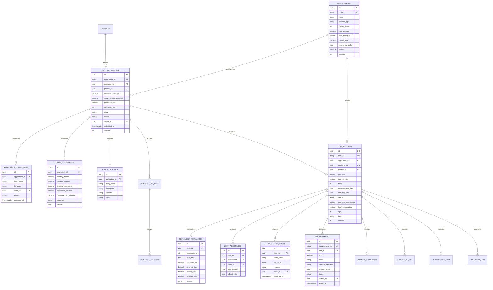
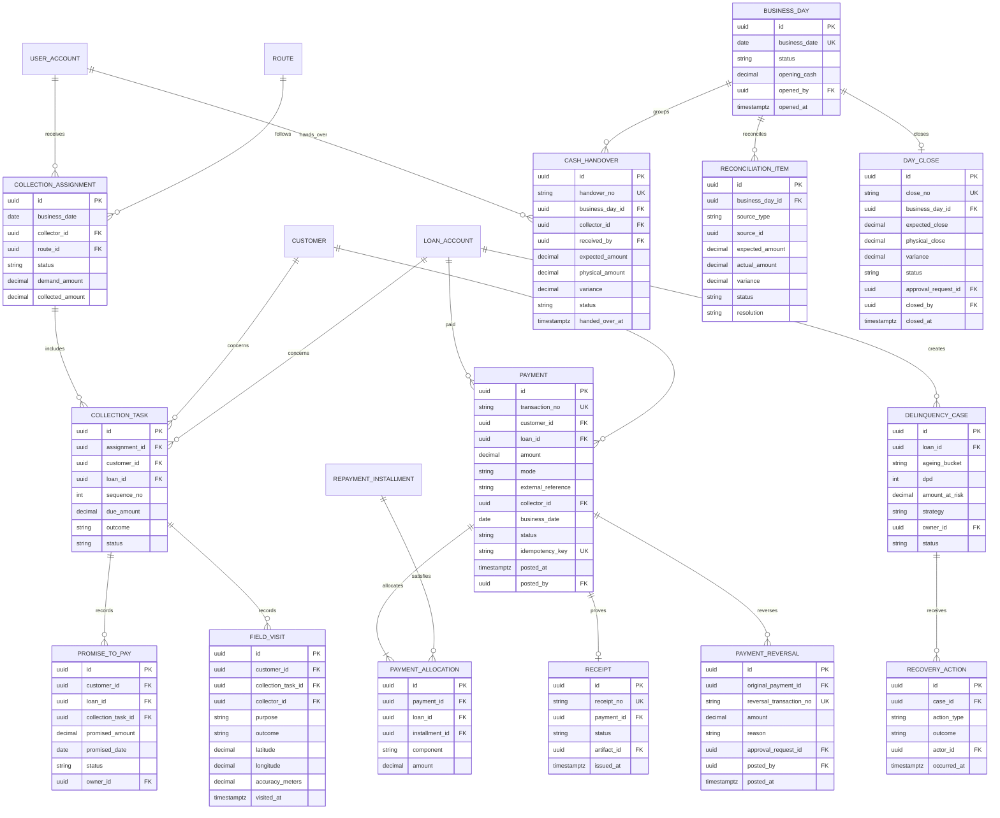
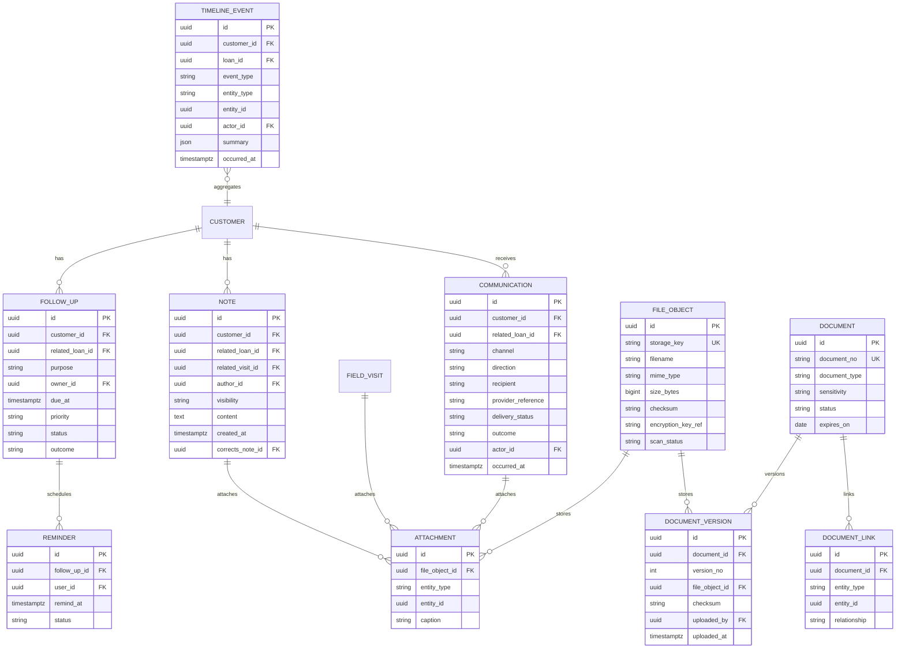
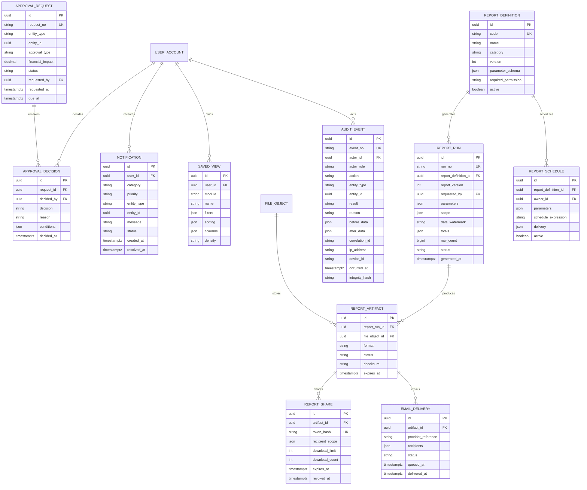
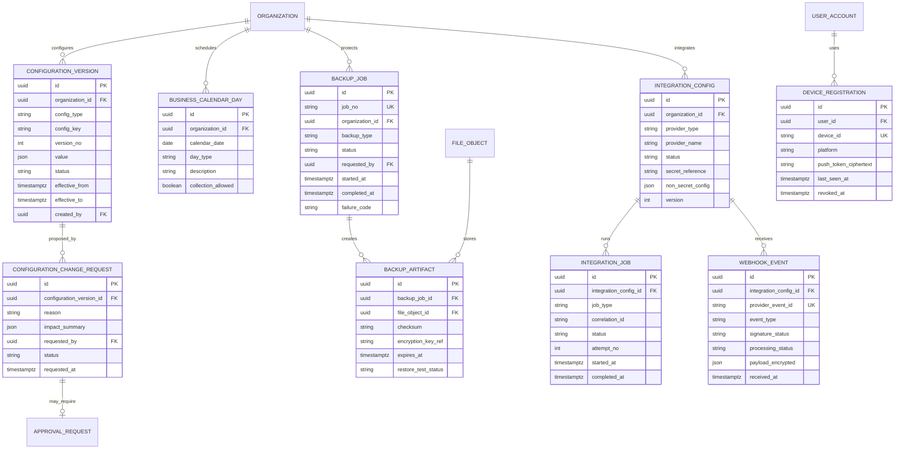

# Sakthi Ledger — Target Database Architecture and Diagram

## 1. Architecture decision

The target enterprise system uses a relational transactional system of record, object storage for files, and derived analytical/read models.

- **Primary transactional database:** PostgreSQL-class relational database.
- **Document/object storage:** encrypted object storage for KYC, agreements, receipts, report artifacts, photographs, and attachments.
- **Cache/queues:** optional Redis-class service for sessions, idempotency, job state, and real-time counters.
- **Search:** database search initially; dedicated search index only when volume justifies it.
- **Analytics:** derived/materialized views or warehouse later; never a second mutable source of truth.

Rationale: payments, allocations, disbursements, approvals, reversals, day close, permissions, and immutable report snapshots require transactions, referential integrity, durable constraints, and clear audit relationships.

The existing Mongo/in-memory structures are treated as prototype data only and require migration into the target model before production.

## 2. Global conventions

- Primary keys: UUID/ULID internal IDs.
- Human-readable IDs: separately unique (`customer_no`, `loan_no`, `receipt_no`).
- Money: fixed-precision decimal or integer paise; never binary floating point.
- Time: UTC timestamp with timezone; business date stored separately where required.
- Soft-deactivation for master data; financial transactions are never deleted.
- Every mutable business record includes created/updated actor and timestamp.
- Version column supports optimistic concurrency.
- Sensitive values are encrypted at field/object level and access is audited.
- Status fields use constrained lifecycle values and transition services.

## 3. Organization, identity, and access

## 4. Customer CRM and identity

```mermaid
erDiagram
    CUSTOMER ||--o{ CUSTOMER_CONTACT : has
    CUSTOMER ||--o{ CUSTOMER_ADDRESS : has
    CUSTOMER ||--o{ CUSTOMER_KYC : verifies
    CUSTOMER_KYC ||--o{ KYC_VERIFICATION_EVENT : records
    CUSTOMER ||--o{ CUSTOMER_RELATIONSHIP : source
    CUSTOMER ||--o{ CUSTOMER_RELATIONSHIP : target
    CUSTOMER ||--o{ EMPLOYMENT : has
    CUSTOMER ||--o{ BUSINESS_PROFILE : operates
    CUSTOMER ||--o{ INCOME_SOURCE : earns
    CUSTOMER ||--o{ HOUSEHOLD_EXPENSE : spends
    CUSTOMER ||--o{ CUSTOMER_CONSENT : grants
    CUSTOMER ||--o{ CUSTOMER_RISK_ASSESSMENT : assessed
    CUSTOMER ||--o{ CREDIT_SCORE : scored
    CUSTOMER ||--o{ CUSTOMER_LOCATION : located
    CUSTOMER ||--o{ FOLLOW_UP : requires
    CUSTOMER ||--o{ COMMUNICATION : receives
    CUSTOMER ||--o{ FIELD_VISIT : visited
    CUSTOMER ||--o{ NOTE : noted
    CUSTOMER ||--o{ DOCUMENT_LINK : owns

    CUSTOMER {
      uuid id PK
      string customer_no UK
      uuid organization_id FK
      uuid area_id FK
      uuid route_id FK
      uuid assigned_collector_id FK
      string full_name
      string preferred_language
      date date_of_birth
      string relationship_status
      string tier
      string kyc_status
      timestamptz created_at
      int version
    }
    CUSTOMER_CONTACT {
      uuid id PK
      uuid customer_id FK
      string type
      string normalized_value
      boolean primary_contact
      boolean verified
      boolean active
    }
    CUSTOMER_ADDRESS {
      uuid id PK
      uuid customer_id FK
      string type
      string line1
      string locality
      string district
      string state
      string postal_code
      decimal latitude
      decimal longitude
      string verification_status
    }
    CUSTOMER_KYC {
      uuid id PK
      uuid customer_id FK
      string document_type
      string identifier_hash UK
      bytes identifier_ciphertext
      string masked_identifier
      string status
      date expires_on
      uuid document_id FK
    }
    KYC_VERIFICATION_EVENT {
      uuid id PK
      uuid customer_kyc_id FK
      string from_status
      string to_status
      uuid actor_id FK
      string reason
      timestamptz occurred_at
    }
    CUSTOMER_RELATIONSHIP {
      uuid id PK
      uuid source_customer_id FK
      uuid target_customer_id FK
      string related_person_name
      string relationship_type
      string responsibility_type
      string verification_status
    }
    EMPLOYMENT {
      uuid id PK
      uuid customer_id FK
      string employer
      string occupation
      date start_date
      decimal monthly_income
      string verification_status
      boolean current
    }
    BUSINESS_PROFILE {
      uuid id PK
      uuid customer_id FK
      string business_name
      string sector
      date started_on
      decimal monthly_revenue
      decimal monthly_profit
      string verification_status
    }
    INCOME_SOURCE {
      uuid id PK
      uuid customer_id FK
      string source_type
      decimal amount
      string frequency
      string reliability
      string verification_status
    }
    HOUSEHOLD_EXPENSE {
      uuid id PK
      uuid customer_id FK
      string category
      decimal amount
      string frequency
    }
    CUSTOMER_CONSENT {
      uuid id PK
      uuid customer_id FK
      string consent_type
      string status
      string channel
      timestamptz granted_at
      timestamptz revoked_at
    }
    CUSTOMER_RISK_ASSESSMENT {
      uuid id PK
      uuid customer_id FK
      decimal score
      string risk_level
      string model_version
      json factors
      timestamptz assessed_at
    }
    CREDIT_SCORE {
      uuid id PK
      uuid customer_id FK
      string source
      decimal score
      string scale
      date retrieved_on
      date expires_on
      uuid report_document_id FK
    }
    CUSTOMER_LOCATION {
      uuid id PK
      uuid customer_id FK
      string location_type
      decimal latitude
      decimal longitude
      decimal accuracy_meters
      string source
      timestamptz captured_at
      uuid captured_by FK
    }
```

## 5. Loan origination, approval, and servicing

## 6. Payments, collections, cash, and delinquency

## 7. Communications, tasks, documents, and timeline

Timeline events may be persisted as a read model/outbox projection from immutable domain events. They do not replace the source tables.

## 8. Approvals, notifications, reports, and audit

## 9. Configuration and lifecycle

Core versioned configuration tables:

- `organization_setting`
- `loan_product`
- `repayment_policy`
- `arrears_policy`
- `approval_policy`
- `receipt_sequence`
- `communication_template`
- `notification_rule`
- `report_definition`
- `retention_policy`
- `integration_config`
- `business_day`
- `configuration_change_request`

Each versioned configuration has draft, approved, scheduled, active, superseded, and revoked states where applicable.

## 10. Critical transaction boundaries

### Payment posting transaction

Atomic:

1. Idempotency check
2. Payment insert
3. Allocation inserts
4. Instalment balances/status update
5. Loan totals/DPD/health update
6. Receipt number and receipt insert
7. Collection task/assignment totals update
8. Domain event/outbox and audit event

### Disbursement transaction

Atomic:

1. Approval/documentation precondition
2. Loan account activation
3. Disbursement insert
4. Repayment schedule generation
5. Assignment creation
6. Timeline/outbox and audit

### Reversal transaction

Atomic linked reversal; original payment and receipt remain immutable.

### Day-close transaction

Close checks, variance approval, close record, business-day lock, report snapshot, and audit must agree.

## 11. Required uniqueness and indexes

- Unique: organization+customer_no, loan_no, application_no, transaction_no, receipt_no, report run/artifact identifiers.
- Unique Aadhaar/identity hash according to organization policy.
- Unique payment idempotency key.
- Customer search: normalized name, mobile, masked identifier suffix, area, route.
- Loan workbench: status, customer, collector, area, product, DPD, maturity.
- Collection queue: business date, collector, route, status, sequence.
- Timeline: customer+occurred_at, loan+occurred_at.
- Follow-up/reminder: owner+status+due_at.
- Audit: occurred_at, actor, entity, action, result, correlation ID.
- Report run/artifact: definition, requested_by, status, generated_at, expiry.

## 12. Privacy and retention

- Aadhaar ciphertext and hash are never returned together to ordinary clients.
- Aadhaar reveal uses a separate authorized service and audit event.
- Document storage keys are never public URLs.
- GPS accuracy/source/consent are stored with coordinates.
- Communications retain consent, provider, and delivery metadata.
- Report snapshots/artifacts inherit field-level masking and retention.
- Audit events are append-only and integrity protected.
- Retention jobs create auditable tombstone/retention events; financial records remain according to statutory policy.

## 13. Current-to-target gap

Existing prototype collections cover users, areas, customers, loans, payments, audit logs, overdue alerts, backups, notifications, and verification events. The target model adds the missing enterprise domains:

- Role permissions and area/route scopes
- Full CRM relationships and communications
- Employment, business, income, expenses
- Explainable risk and credit scores
- Applications, stages, assessments, deviations, approvals
- Repayment instalments and typed allocations
- Payment idempotency and linked reversals
- Routes, tasks, promises, visits, GPS, handovers, reconciliation, day close
- Documents, versions, attachments, and object storage
- Immutable report snapshots, actual artifacts, sharing, and email delivery
- Versioned configuration and approval policies
- Durable notification/task lifecycle
- Correlated immutable audit model

## 14. Database acceptance gate

- Every Screen Map field has a source or explicit derived calculation.
- Every workflow mutation has a transaction boundary and audit event.
- Every status transition is constrained and documented.
- Every sensitive field has encryption, masking, permission, and retention rules.
- Payment/disbursement/reversal/day-close tests prove atomicity and idempotency.
- Report artifacts prove format, snapshot, permission, and retention linkage.
- No production money field uses floating-point storage.
