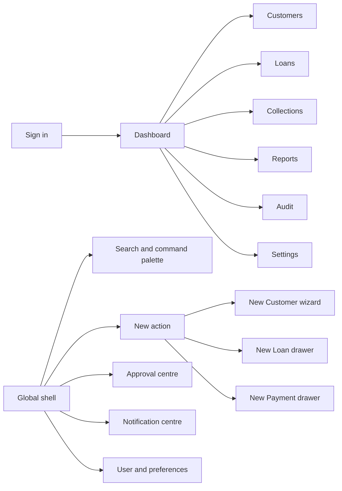

# Sakthi Ledger — Navigation Map

## 1. Navigation model

Sakthi Ledger uses stable domain navigation, contextual record navigation, and global command layers. Permissions remove unavailable destinations without reordering the remaining modules.

## 2. Complete hierarchy

```mermaid
flowchart TD
    ROOT[Sakthi Ledger]
    ROOT --> D[Dashboard]
    ROOT --> C[Customers]
    ROOT --> L[Loans]
    ROOT --> COL[Collections]
    ROOT --> R[Reports]
    ROOT --> A[Audit]
    ROOT --> S[Settings]

    D --> D1[Executive command centre]
    D --> D2[Today's operations]
    D --> D3[Area performance]
    D --> D4[Collector performance]

    C --> C1[Customer workbench]
    C --> C2[KYC work queue]
    C --> C3[Follow-up work queue]
    C --> C4[Customer 360]
    C4 --> C41[Overview]
    C4 --> C42[Timeline]
    C4 --> C43[Loans]
    C4 --> C44[Calendar]
    C4 --> C45[Communications]
    C4 --> C46[Documents]
    C4 --> C47[Relationships]
    C4 --> C48[Profile and capacity]
    C4 --> C49[Field activity]

    L --> L1[Origination pipeline]
    L --> L2[Applications table]
    L --> L3[Active loans]
    L --> L4[Overdue loans]
    L --> L5[Closed loans]
    L --> L6[Loan 360]
    L6 --> L61[Overview]
    L6 --> L62[Schedule]
    L6 --> L63[Payments]
    L6 --> L64[Collections history]
    L6 --> L65[Documents]
    L6 --> L66[Approvals]
    L6 --> L67[Timeline]

    COL --> O1[Collection control room]
    COL --> O2[Collector routes]
    COL --> O3[Demand work queue]
    COL --> O4[Payments and receipts]
    COL --> O5[Promises and follow-ups]
    COL --> O6[Cash handover]
    COL --> O7[Reconciliation]
    COL --> O8[Day close]
    COL --> O9[Delinquency workbench]

    R --> R1[Report catalogue]
    R --> R2[Saved reports]
    R --> R3[Scheduled reports]
    R --> R4[Report workspace]
    R --> R5[Export history]
    R4 --> R41[Preview]
    R4 --> R42[PDF]
    R4 --> R43[Excel]
    R4 --> R44[CSV]
    R4 --> R45[Print]
    R4 --> R46[Share]
    R4 --> R47[Email]

    A --> A1[Audit workbench]
    A --> A2[Sensitive access]
    A --> A3[Financial actions]
    A --> A4[Configuration changes]
    A --> A5[Export and sharing]

    S --> S1[Organization]
    S --> S2[Areas and routes]
    S --> S3[Users roles permissions]
    S --> S4[Loan products and policies]
    S --> S5[Collections and arrears]
    S --> S6[Payment and receipts]
    S --> S7[Communication channels]
    S --> S8[Reports exports email sharing]
    S --> S9[Security privacy retention]
    S --> S10[Backup recovery]
    S --> S11[Language date financial year]
    S --> S12[Integrations]
```

## 3. Desktop navigation order

1. Dashboard
2. Customers
3. Loans
4. Collections
5. Reports
6. Audit
7. Settings

The order never changes by role. Unauthorized modules are omitted; authorized modules do not move to different positions.

## 4. Role visibility matrix

Legend: **Full**, **Scoped**, **Task**, **None**.

| Destination | Owner | Manager | Accountant | Collector |
|---|---|---|---|---|
| Dashboard | Full organization | Scoped area/team | Finance/collection scope | Personal route/tasks |
| Customers | Full | Scoped | Read + payment context | Assigned/route customers |
| Customer 360 | Full sensitive by policy | Scoped sensitive by policy | Financial/read scope | Assigned servicing scope |
| New Customer | Full | Yes | No by default | Yes if policy permits |
| Loans | Full | Scoped | Financial/read | Assigned/read |
| New Loan | Full | Yes | No by default | Draft/referral if policy permits |
| Loan approval | Full | Threshold-based | None | None |
| Collections | Full | Scoped control | Full reconciliation | Personal route/payment |
| New Payment | Full | Yes | Yes | Assigned/customer context |
| Reversal | Approve/request | Request | Request/execute by policy | None |
| Reports | Full | Scoped | Finance/report scope | Personal limited |
| Audit | Full | Scoped operational subset | Financial subset | Own actions only if exposed |
| Settings | Full | Operational subset | Finance subset | Preferences only |

Exact permissions are capabilities, not only role names. The database stores role defaults and user/area overrides.

## 5. Global routes

| Route pattern | Screen |
|---|---|
| `/login` | Sign in |
| `/` | Role-composed Dashboard |
| `/search?q=` | Search results/deep-linkable query |
| `/approvals` | Approval centre |
| `/notifications` | Notification centre |
| `/profile` | User profile/preferences |

## 6. Module routes

### Customers

| Route | Screen |
|---|---|
| `/customers` | Customer workbench |
| `/customers/kyc` | KYC queue |
| `/customers/follow-ups` | Follow-up queue |
| `/customers/:customerId` | Customer 360 Overview |
| `/customers/:customerId/timeline` | Master Timeline |
| `/customers/:customerId/loans` | Customer loans |
| `/customers/:customerId/calendar` | Payment/Collection/Agenda calendar |
| `/customers/:customerId/communications` | Communications |
| `/customers/:customerId/documents` | Document Center |
| `/customers/:customerId/relationships` | Family/guarantors |
| `/customers/:customerId/profile` | Employment/business/income |
| `/customers/:customerId/field` | Map/visits/GPS/notes |

New Customer is an overlay workflow and may use `/customers/new?returnTo=` for resumable/deep-linked state.

### Loans

| Route | Screen |
|---|---|
| `/loans/pipeline` | Origination pipeline |
| `/loans/applications` | Applications table |
| `/loans/active` | Active loans |
| `/loans/overdue` | Overdue loans |
| `/loans/closed` | Closed loans |
| `/loans/:loanId` | Loan 360 Overview |
| `/loans/:loanId/schedule` | Repayment schedule |
| `/loans/:loanId/payments` | Payment ledger |
| `/loans/:loanId/collections` | Collection history |
| `/loans/:loanId/documents` | Loan documents |
| `/loans/:loanId/approvals` | Approval history |
| `/loans/:loanId/timeline` | Loan Timeline |

New Loan uses drawer URL state `/loans/new?customer=&returnTo=`.

### Collections

| Route | Screen |
|---|---|
| `/collections` | Collection control room |
| `/collections/routes` | Collector route overview |
| `/collections/routes/:routeId` | Route detail |
| `/collections/demand` | Demand work queue |
| `/collections/payments` | Payments and receipts |
| `/collections/promises` | Promises/follow-ups |
| `/collections/handover` | Cash handover |
| `/collections/reconciliation` | Reconciliation |
| `/collections/day-close` | Day close |
| `/collections/delinquency` | Delinquency workbench |

New Payment uses drawer URL state `/collections/payments/new?customer=&loan=&returnTo=`.

### Reports

| Route | Screen |
|---|---|
| `/reports` | Catalogue |
| `/reports/saved` | Saved reports |
| `/reports/scheduled` | Scheduled reports |
| `/reports/:reportType` | Report parameters/workspace |
| `/reports/runs/:runId` | Immutable Preview |
| `/reports/exports` | Export History |

### Audit and Settings

Audit filters use URL state. Settings use stable slug routes under `/settings/:section`.

## 7. Context navigation

- Customer identity links to Customer 360.
- Loan identity links to Loan 360.
- Payment/receipt opens Quick View first; full ledger remains available.
- Approval links to related customer/loan/payment/configuration without losing queue state.
- Audit event links to related object only when permitted.
- Report row drill-down opens the responsible filtered workbench.

## 8. Mobile navigation

Role-priority bottom navigation:

### Owner

Dashboard, Customers, Loans, Collections, More.

### Manager

Dashboard, Customers, Loans, Collections, More.

### Accountant

Dashboard, Collections, Reports, Approvals, More.

### Collector

Today/Route, Customers, Payment, Follow-ups, More.

“More” preserves the global stable module hierarchy. The New action remains separate and permission-aware.

## 9. Navigation state preservation

Navigation must preserve:

- Area/date/scheme scope where semantically reusable
- Saved view
- Search query
- Filters and sorting
- Pagination and selected row
- Record tab
- Drawer origin/return path
- Scroll position

Browser Back/Forward must restore meaningful workspace state rather than reset the module.

## 10. Navigation acceptance

- Every Screen Map entry has one canonical route or documented overlay state.
- No screen is reachable only through an unlabeled icon.
- Permissions are enforced server-side and reflected client-side.
- Mobile and desktop lead to the same business object and state.
- Deep links handle expired sessions and removed permissions safely.
- Record-to-record navigation preserves current work queue context.
