# Sakthi Ledger — Workflow Diagrams

## 1. Customer onboarding and KYC

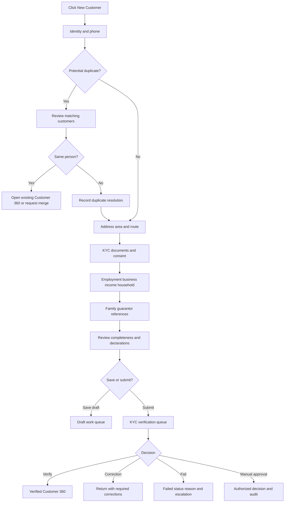

Controls: Aadhaar hash duplicate check, ciphertext storage, masked UI, consent, reason capture, role permission, audit.

## 2. Loan origination to disbursement

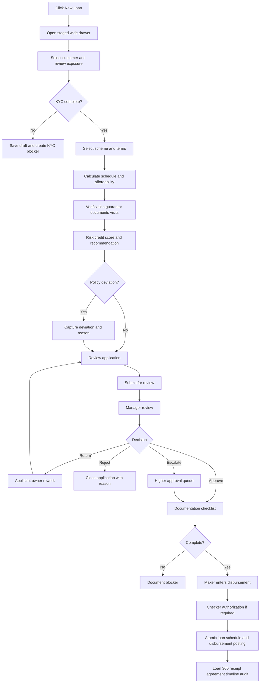

## 3. Payment posting and receipt

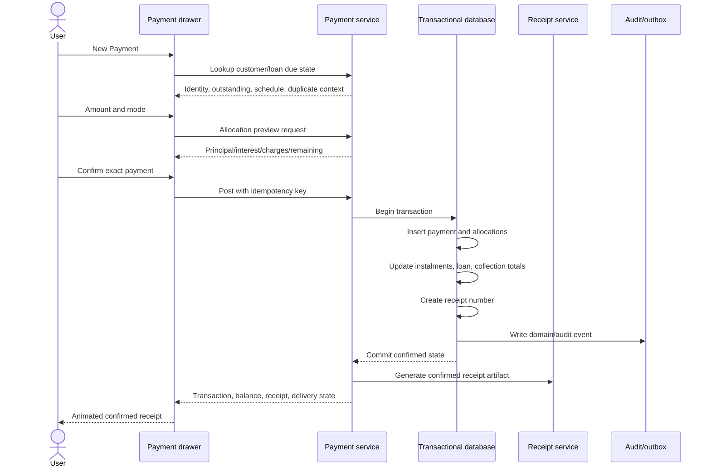

Failure branches:

- Before commit → “Payment was not posted. No money was recorded.”
- Commit confirmed, artifact failed → payment succeeds; receipt regeneration available.
- Unknown network outcome → verification by idempotency/correlation ID before retry.

## 4. Collector daily operations

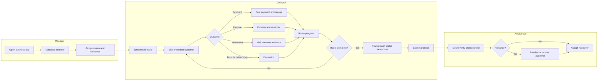

## 5. Delinquency and recovery

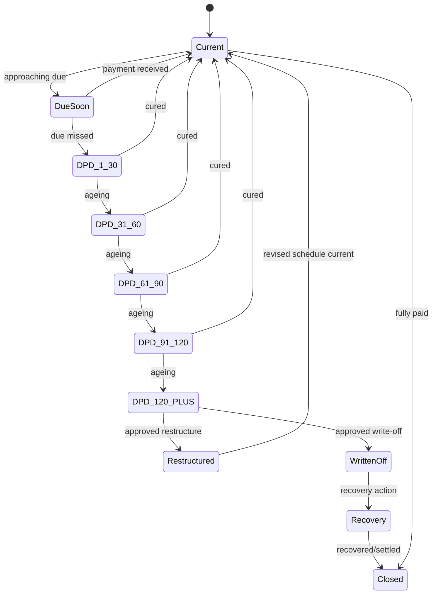

Each transition records DPD, amount at risk, policy version, actor/system source, strategy, and timeline/audit event.

## 6. Promise and follow-up

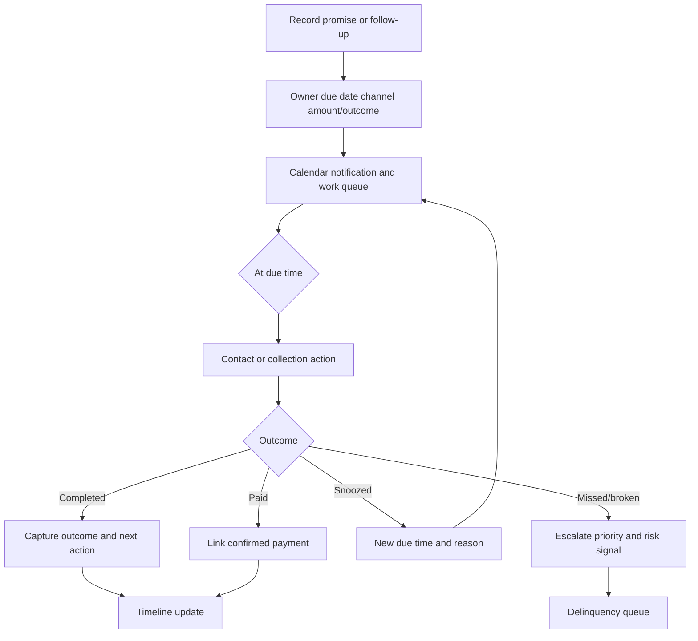

## 7. Payment reversal approval

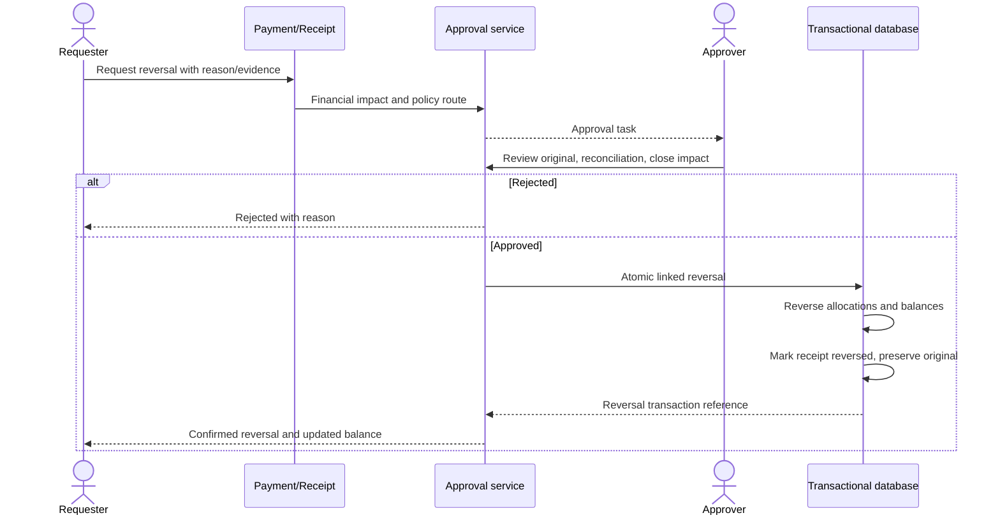

## 8. Cash reconciliation and day close

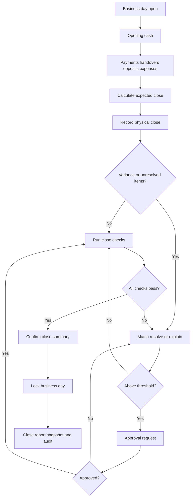

## 9. Report generation and delivery

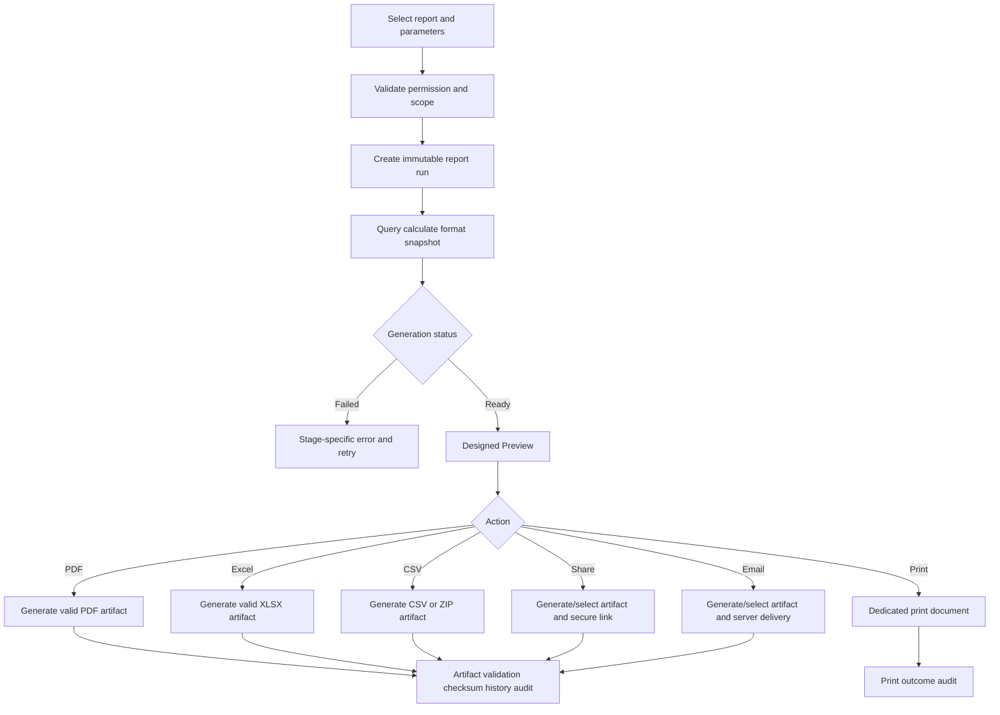

## 10. Customer communication and visit

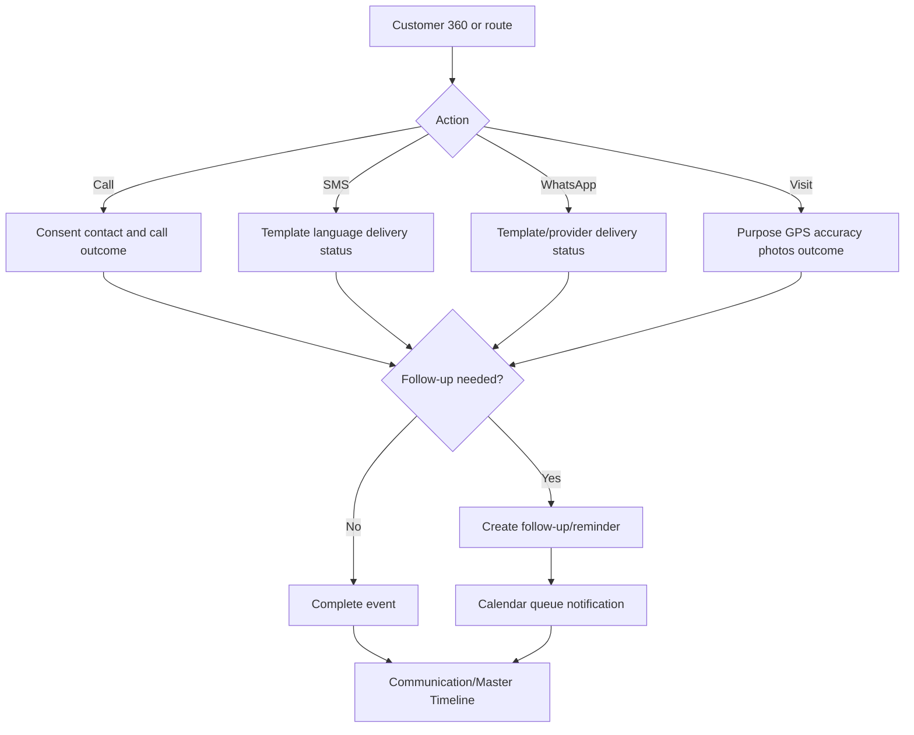

## 11. Configuration change

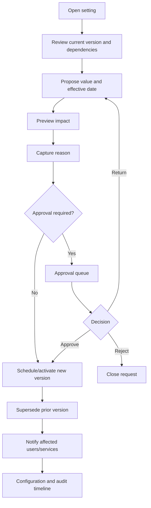

## 12. Audit event pipeline

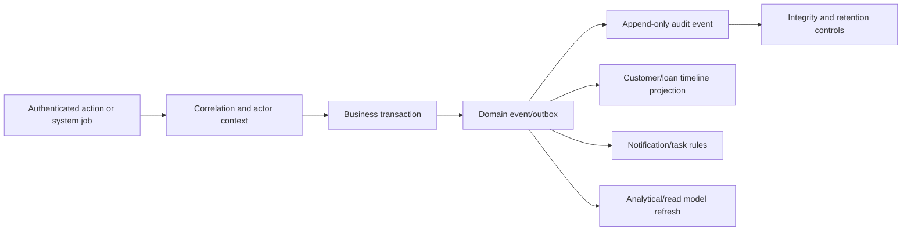

## 13. Offline collection sync

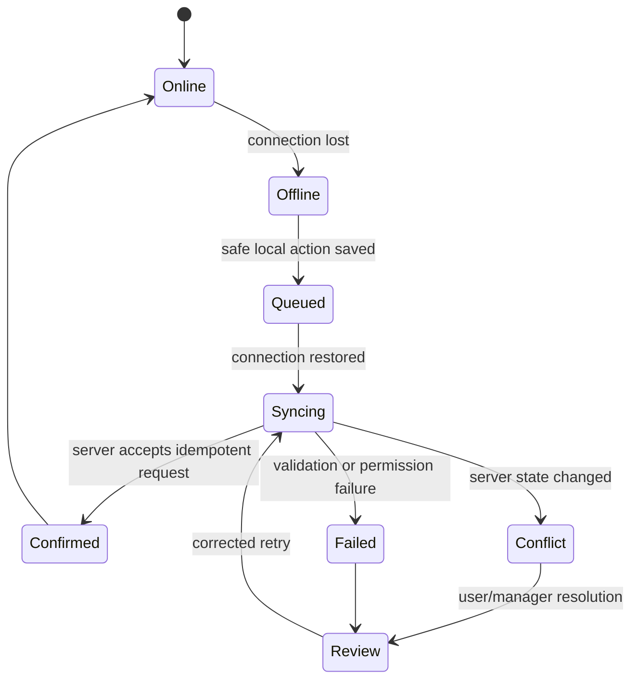

Money is never shown as server-confirmed while only queued locally. Local and server references remain distinct until reconciliation.

## 14. Workflow acceptance

Every implemented workflow must match its diagram and include:

- Entry permission
- Preconditions
- State transitions
- Validation
- Confirmation/consequence
- Transaction/idempotency boundary
- Success evidence
- Failure and uncertain outcome
- Notification/timeline/audit effects
- Mobile/offline/reduced-motion behavior
